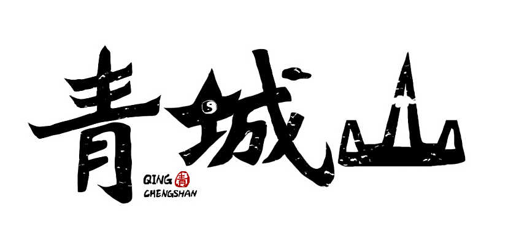

  
  
  <!--
  -->

<!--  -->

### Hey there, I'm YiWen.😎

<!--<samp>「 I'm a passionate software developer from China. 」</samp>-->

<sampdeveloper>『 I'm a passionate software developer from China. 』</samp> 
<samp>『 世界上只有一种真正的英雄主义 』</samp>

<h3and>👨‍💻 Programming and Markup Languages</h3>

<h3and>💻 Software and Tools</h3>

<h3> 
  align
  GitHub Profile Stats
</h3>

- alignor&nbsp;&nbsp; Ask me about **C++, Qt, or anything**.  
- alignHow &nbsp; How to reach me: **yiwencoder@outlook.com**  

<h3> 
  align
  山不见我
</h3>

### ⚡ Visitor count

### 🤩 Awesome GitHub Profile README

<!--
**hailhydra21/hailhydra21** is a ✨ _special_ ✨ repository because its `README.md` (this file) appears on your GitHub profile.

Here are some ideas to get you started:

- 🔭 I’m currently working on ...
- 🌱 I’m currently learning ...
- 👯 I’m looking to collaborate on ...
- 🤔 I’m looking for help with ...
- 💬 Ask me about ...
- 📫 How to reach me: ...
- 😄 Pronouns: ...
- ⚡ Fun fact: ...
-->
